# 🗺️ LoadMaster – Tài liệu Luồng Nghiệp vụ & Kiến trúc Hệ thống (Issues 2)

> **Tài liệu trực quan hóa toàn bộ 8 Luồng Nghiệp vụ & 45 Issues (Sprint 3b → Sprint 8)**  
> **Cơ sở đối chiếu:** `prd.md` (PRD v2.0) & thư mục `issues 2/`  
> **Hệ thống:** LoadMaster Backend (`LoadMasterService` - Spring Boot 3 & `OptimizeService` - FastAPI)

---

## 📑 Mục lục

1. [Kiến trúc Tổng thể Hệ thống (System Architecture)](#1-kiến-trúc-tổng-thể-hệ-thống)
2. [Sơ đồ Thực thể Dữ liệu Mở rộng (ERD Diagram)](#2-sơ-đồ-thực-thể-dữ-liệu-mở-rộng-erd)
3. [Vòng đời Trạng thái Cốt lõi (Core State Machines)](#3-vòng-đời-trạng-thái-cốt-lõi)
   - 3.1 Vòng đời Chuyến xe (Trip Lifecycle)
   - 3.2 Vòng đời Kiện hàng (Package Lifecycle)
   - 3.3 Vòng đời Yêu cầu Pickup (Pickup Request Lifecycle)
   - 3.4 Vòng đời Giao dịch Credit (Credit Lifecycle)
4. [Flow 1 (Sprint 3b) — Import Đơn hàng, Parse File, Sinh QR Code & In nhãn PDF](#4-flow-1-sprint-3b--import-đơn-hàng-sinh-qr-code--in-nhãn-pdf)
5. [Flow 2 (Sprint 4b) — Điều kiện Giao nhận, Phân tách Hàng & Tối ưu Lộ trình (Goong Maps)](#5-flow-2-sprint-4b--điều-kiện-giao-nhận-phân-tách-hàng--tối-ưu-lộ-trình)
6. [Flow 3 (Sprint 5b) — Tối ưu Xếp dỡ 3D Đa điểm (Stop Zones, COG & Axle Load)](#6-flow-3-sprint-5b--tối-ưu-xếp-dỡ-3d-đa-điểm-stop-zones-cog--axle-load)
7. [Flow 4 & 5 (Sprint 6) — Duyệt Kế hoạch, Xuất kho & Quét QR Đối soát Tải xe](#7-flow-4--5-sprint-6--duyệt-kế-hoạch-xuất-kho--quét-qr-đối-soát)
8. [Flow 6 (Sprint 6) — Giám sát GPS Real-time, Tính ETA & Xử lý Ngoại lệ Chuyến đi](#8-flow-6-sprint-6--giám-sát-gps-real-time-tính-eta--xử-lý-ngoại-lệ)
9. [Flow 7 (Sprint 7) — Nhận thêm Hàng Dọc đường & Tái Tối ưu Không gian Giải phóng](#9-flow-7-sprint-7--nhận-thêm-hàng-dọc-đường--tái-tối-ưu-freed-zone)
10. [Flow 8 (Sprint 8) — Gói cước (Subscription), Số dư Credit & Cổng Thanh toán VNPay](#10-flow-8-sprint-8--gói-cước-subscription-credit--cổng-vnpay)
11. [Ma trận Ánh xạ Issues 2 (Sprint 3b → Sprint 8)](#11-ma-trận-ánh-xạ-issues-2)

---

## 1. Kiến trúc Tổng thể Hệ thống

Hệ thống gồm 2 backend services chính dùng chung PostgreSQL DB, tích hợp các đối tác dịch vụ bên ngoài (Goong Maps, VNPay, Keycloak) và giao tiếp thời gian thực qua WebSocket STOMP.

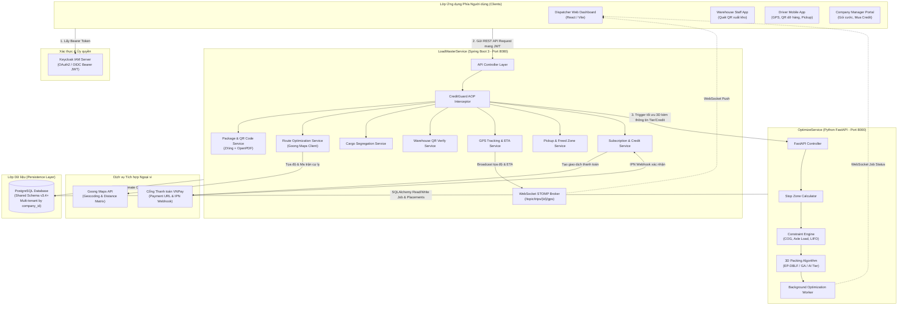

---

## 2. Sơ đồ Thực thể Dữ liệu Mở rộng (ERD)

Sơ đồ thể hiện đầy đủ các trường và mối quan hệ giữa các bảng được thêm mới hoặc bổ sung qua các migration trong `issues 2`:

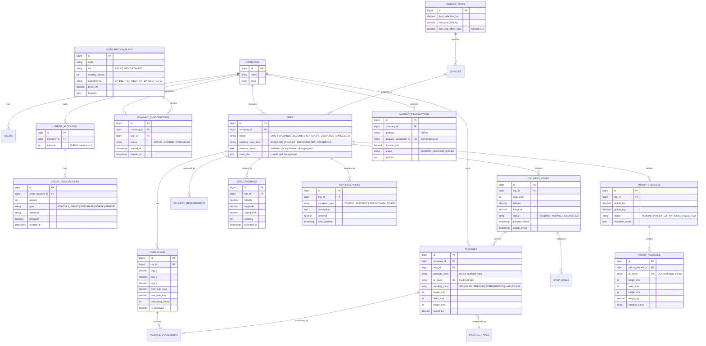

---

## 3. Vòng đời Trạng thái Cốt lõi

### 3.1 Vòng đời Chuyến xe (Trip Lifecycle)

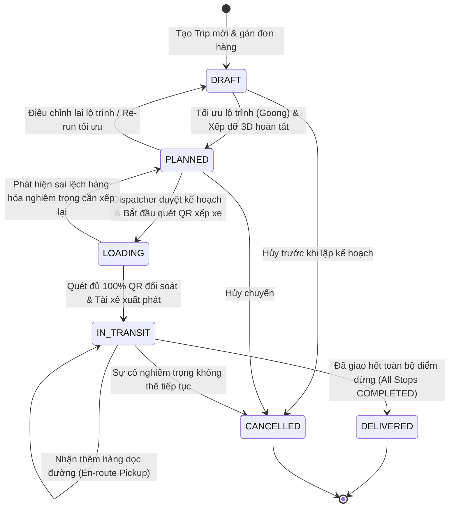

### 3.2 Vòng đời Kiện hàng (Package Lifecycle)

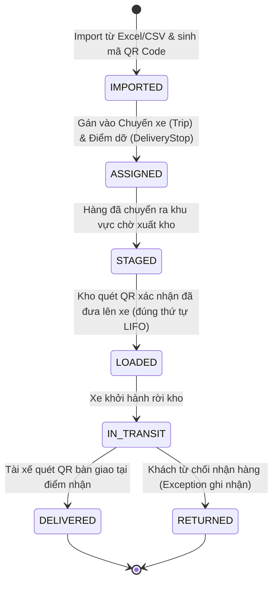

### 3.3 Vòng đời Yêu cầu Pickup (Pickup Request Lifecycle)

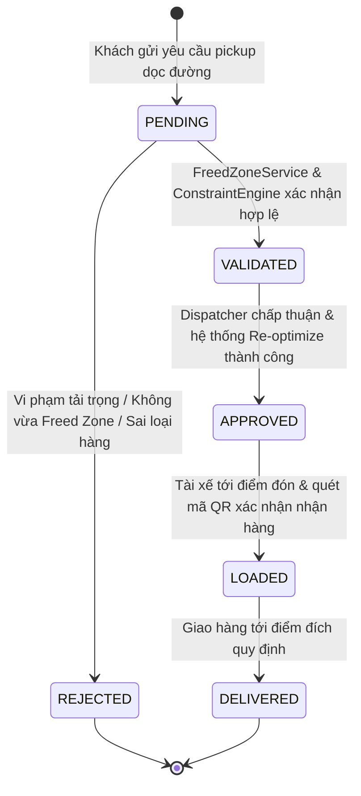

### 3.4 Vòng đời Giao dịch Credit (Credit Lifecycle)

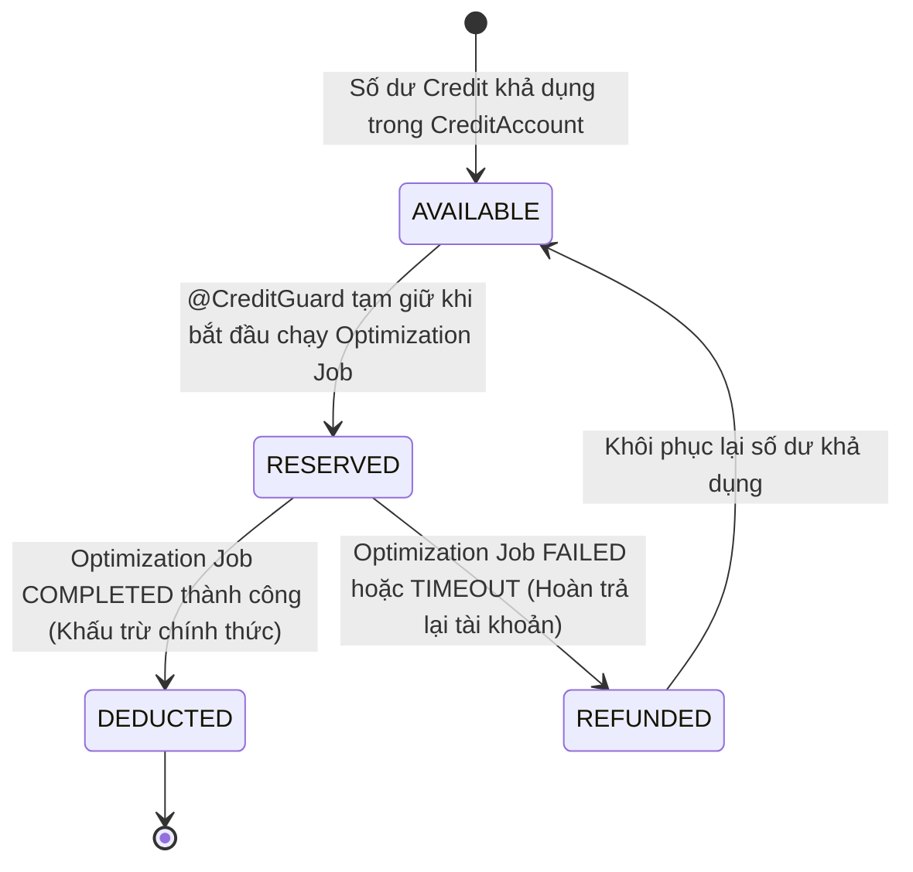

---

## 4. Flow 1 (Sprint 3b) — Import Đơn hàng, Sinh QR Code & In nhãn PDF

> **Issues thực hiện:** `S3b-01` → `S3b-07`  
> **Mục tiêu:** Nhập dữ liệu hàng loạt từ file Excel/CSV, xác thực kích thước/loại hàng, sinh mã định danh UUID bất biến và xuất file PDF nhãn nhấc hàng chuẩn A6.

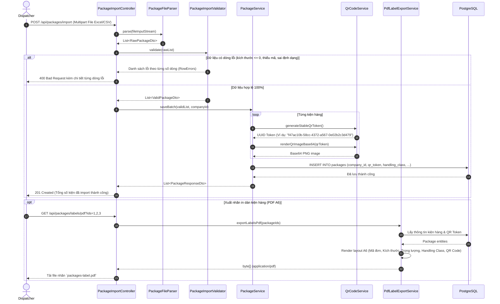

---

## 5. Flow 2 (Sprint 4b) — Điều kiện Giao nhận, Phân tách Hàng & Tối ưu Lộ trình

> **Issues thực hiện:** `S4b-01` → `S4b-08`  
> **Mục tiêu:** Kiểm tra xung đột loại hàng (Cargo Segregation), gọi Goong Maps API tối ưu hóa thứ tự các điểm dừng dỡ hàng (Stop Sequence) theo quy tắc LIFO.

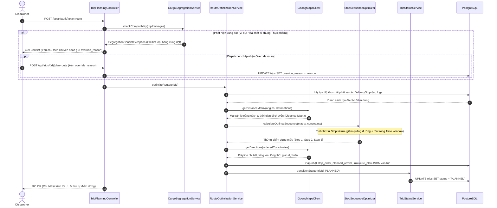

---

## 6. Flow 3 (Sprint 5b) — Tối ưu Xếp dỡ 3D Đa điểm (Stop Zones, COG & Axle Load)

> **Issues thực hiện:** `S5b-01` → `S5b-07`  
> **Mục tiêu:** Tính toán không gian khoang xe phân bổ theo điểm dừng dỡ hàng (Stop Zones theo thứ tự LIFO), đảm bảo trọng tâm xe (COG) và không vượt tải trọng trục (Axle Load).

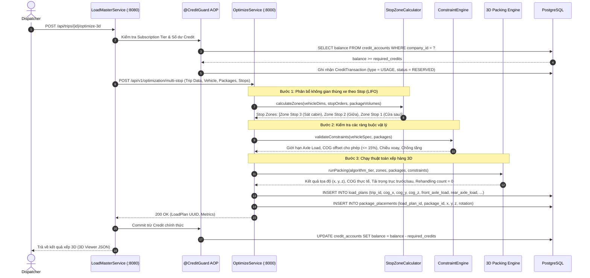

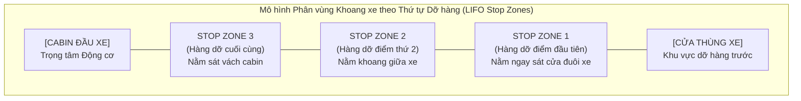

---

## 7. Flow 4 & 5 (Sprint 6) — Duyệt Kế hoạch, Xuất kho & Quét QR Đối soát

> **Issues thực hiện:** `S6-01`, `S6-02`, `S4b-08`  
> **Mục tiêu:** Quản trị viên duyệt kế hoạch xếp hàng, nhân viên kho dùng thiết bị cầm tay quét mã QR đối soát kiện hàng lên xe, đảm bảo xếp đúng thứ tự LIFO và không nhầm lẫn xe.

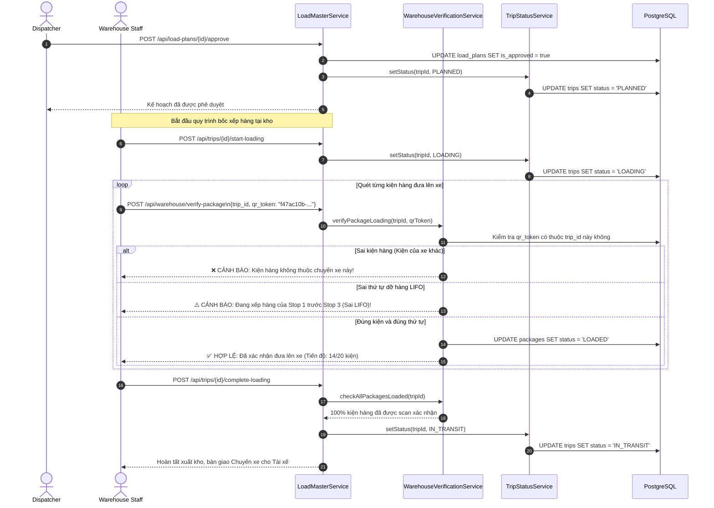

---

## 8. Flow 6 (Sprint 6) — Giám sát GPS Real-time, Tính ETA & Xử lý Ngoại lệ

> **Issues thực hiện:** `S6-03` → `S6-10`  
> **Mục tiêu:** Nhận tọa độ GPS liên tục từ ứng dụng Tài xế, tính toán lại thời gian đến dự kiến (ETA), phát hiện lệch lộ trình và xử lý ngoại lệ giao nhận (tắc đường, tai nạn).

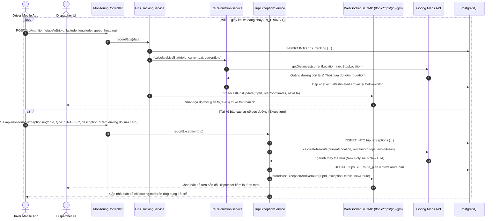

---

## 9. Flow 7 (Sprint 7) — Nhận thêm Hàng Dọc đường & Tái Tối ưu Freed Zone

> **Issues thực hiện:** `S7-01` → `S7-05`  
> **Mục tiêu:** Tận dụng không gian khoang xe đã được giải phóng (Freed Zone) sau khi dỡ hàng tại các Stop trước để nhận thêm hàng mới mà không làm xáo trộn hàng còn lại.

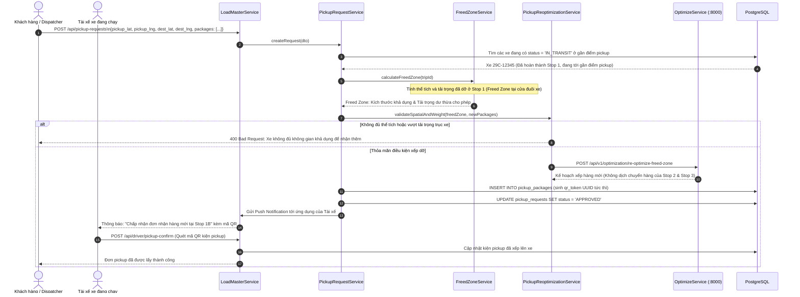

---

## 10. Flow 8 (Sprint 8) — Gói cước (Subscription), Credit & Cổng VNPay

> **Issues thực hiện:** `S8-01` → `S8-08`  
> **Mục tiêu:** Quản lý gói cước công ty (Basic, Pro, Ultimate), nạp tiền mua credit qua VNPay có kiểm tra Idempotency, và áp dụng AOP `@CreditGuard` bảo vệ API tối ưu.

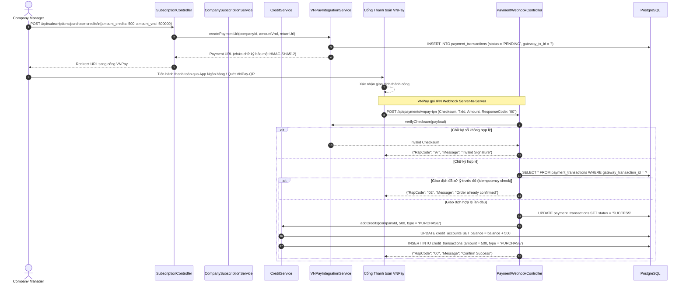

---

## 11. Ma trận Ánh xạ Issues 2

| Sprint | Mã Issue | Tên Issue & Mô tả | Flow Nghiệp vụ | Thành phần Chính (Files) |
|---|---|---|---|---|
| **3b** | `S3b-01` | Entity Migration Package QR & Handling Class | Flow 1 | `V{n}__package_qr.sql`, `Package.java` |
| **3b** | `S3b-02` | CSV/Excel File Parser Service | Flow 1 | `PackageFileParser.java`, `Apache POI` |
| **3b** | `S3b-03` | Package Import Validator | Flow 1 | `PackageImportValidator.java` |
| **3b** | `S3b-04` | QR Code Generation Service (UUID Stable) | Flow 1 | `QrCodeService.java`, `ZXing` |
| **3b** | `S3b-05` | Package Import Batch Service | Flow 1 | `PackageImportService.java` |
| **3b** | `S3b-06` | Package Import REST Controller | Flow 1 | `PackageImportController.java` |
| **3b** | `S3b-07` | PDF Label Export Service (A6 Print) | Flow 1 | `PdfLabelExportService.java`, `OpenPDF` |
| **4b** | `S4b-01` | Entity Migration Trip Status & Stop Lat/Lng | Flow 2, 6 | `V{n}__trip_stop.sql`, `Trip.java` |
| **4b** | `S4b-02` | Delivery Requirement CRUD | Flow 2 | `DeliveryRequirementService.java` |
| **4b** | `S4b-03` | Cargo Segregation Service & Override Log | Flow 2 | `CargoSegregationService.java` |
| **4b** | `S4b-04` | Goong Maps API Client (Geocode, Matrix) | Flow 2, 6 | `GoongMapsClient.java`, `RestTemplate` |
| **4b** | `S4b-05` | Stop Sequence Optimizer (TSP / LIFO) | Flow 2 | `StopSequenceOptimizer.java` |
| **4b** | `S4b-06` | Route Optimization Service | Flow 2 | `RouteOptimizationService.java` |
| **4b** | `S4b-07` | Trip Planning Controller | Flow 2 | `TripPlanningController.java` |
| **4b** | `S4b-08` | Trip Status State Machine Service | Flow 2, 4 | `TripStatusService.java` |
| **5b** | `S5b-01` | Entity Migration 3D Constraints (COG, Axle) | Flow 3 | `V{n}__3d_engine.sql`, `LoadPlan.java` |
| **5b** | `S5b-02` | Stop Zone Calculator (LIFO Partitioning) | Flow 3 | `StopZoneCalculator.py` (FastAPI) |
| **5b** | `S5b-03` | Physical Constraint Engine (COG, Stacking) | Flow 3 | `ConstraintEngine.py` (FastAPI) |
| **5b** | `S5b-04` | 3D Packing Engine Upgrade (Multi-stop) | Flow 3 | `packing_engine.py` (FastAPI) |
| **5b** | `S5b-05` | Algorithm Tier Service (Basic/GA/AI) | Flow 3, 8 | `AlgorithmTierService.java` |
| **5b** | `S5b-06` | Trip 3D Validation Upgrade | Flow 3 | `TripValidationService.java` |
| **5b** | `S5b-07` | Load Plan API Upgrade | Flow 3 | `LoadPlanController.java` |
| **6** | `S6-01` | Approve Trip & Load Plan Upgrade | Flow 4 | `LoadPlanApprovalService.java` |
| **6** | `S6-02` | Warehouse QR Verification Service | Flow 4, 5 | `WarehouseVerificationService.java` |
| **6** | `S6-03` | Entity Migration GpsTracking & TripException | Flow 6 | `V{n}__gps_exception.sql` |
| **6** | `S6-04` | GPS Tracking Ingestion Service | Flow 6 | `GpsTrackingService.java` |
| **6** | `S6-05` | Live ETA Calculation Service | Flow 6 | `EtaCalculationService.java` |
| **6** | `S6-06` | Trip Monitoring Dashboard Service | Flow 6 | `TripMonitoringService.java` |
| **6** | `S6-07` | Trip Monitoring REST Controller | Flow 6 | `MonitoringController.java` |
| **6** | `S6-08` | Trip Exception Handling Service | Flow 6 | `TripExceptionService.java` |
| **6** | `S6-09` | Dynamic Reroute Service | Flow 6 | `RerouteService.java` (Goong) |
| **6** | `S6-10` | WebSocket GPS Broadcast Handler | Flow 6 | `GpsWebSocketHandler.java` |
| **7** | `S7-01` | Entity Migration PickupRequest & Package | Flow 7 | `V{n}__pickup.sql`, `PickupRequest.java` |
| **7** | `S7-02` | Pickup Request Service & Eligibility Check | Flow 7 | `PickupRequestService.java` |
| **7** | `S7-03` | On-the-fly Pickup QR Code Service | Flow 7 | `PickupQrService.java` |
| **7** | `S7-04` | Freed Zone Calculation Service | Flow 7 | `FreedZoneService.java` |
| **7** | `S7-05` | En-route Pickup Re-optimization Service | Flow 7 | `PickupReoptimizationService.java` |
| **8** | `S8-01` | Entity Migration Subscription, Credit, VNPay | Flow 8 | `V{n}__subscription_credit.sql` |
| **8** | `S8-02` | Subscription Plan Management Service | Flow 8 | `SubscriptionPlanService.java` |
| **8** | `S8-03` | Company Subscription Service | Flow 8 | `CompanySubscriptionService.java` |
| **8** | `S8-04` | Credit Management Service (Deduct/Refund) | Flow 8 | `CreditService.java` |
| **8** | `S8-05` | VNPay Payment Integration Service | Flow 8 | `VNPayService.java` |
| **8** | `S8-06` | Payment Webhook Controller (Idempotency) | Flow 8 | `PaymentWebhookController.java` |
| **8** | `S8-07` | Subscription & Credit REST Controller | Flow 8 | `SubscriptionController.java` |
| **8** | `S8-08` | @CreditGuard AOP Interceptor | Flow 8 | `CreditGuardAspect.java` |

---

> **Lưu ý triển khai:**  
> - Toàn bộ các migration SQL phải đánh số version tăng dần theo `V{next}__...` nối tiếp Flyway schema hiện hữu của `LoadMasterService`.  
> - Các file Mermaid trong tài liệu này có thể render trực tiếp trên GitHub, GitLab, VS Code Markdown Preview hoặc [Mermaid Live Editor](https://mermaid.live).
